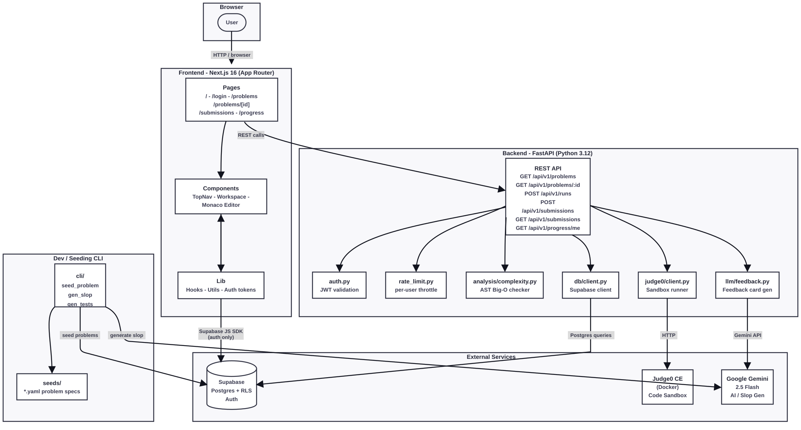

# Debug Dojo

**A coding-practice platform where developers fix deliberately buggy AI-generated Python code.**


Debug Dojo turns debugging into short, repeatable drills. Each problem starts with a working-looking
but flawed Python function. The user reads the prompt, fixes the function in a Monaco editor, runs
visible tests for fast feedback, and submits against hidden tests for a final verdict. The backend
judges both correctness and estimated time complexity.

## Quick Start

```sh
git clone https://github.com/MatthewBlam/debug-dojo.git
cd debug-dojo
make install
cp backend/.env.example backend/.env
cp frontend/.env.example frontend/.env.local
# Fill in Supabase and Gemini API keys (see Environment Variables below)
make dev
```

This starts Judge0 (Docker required), FastAPI on `http://127.0.0.1:8000`, and Next.js on `http://localhost:3000`.

To run without Judge0 (no code execution):

```sh
make dev-no-judge0
```

See [Prerequisites](#prerequisites) and [Environment Variables](#environment-variables) for full details.

## Table of Contents

- [Quick Start](#quick-start)
- [What It Does](#what-it-does)
- [Feature Set](#feature-set)
- [Tech Stack](#tech-stack)
- [Architecture](#architecture)
- [Runtime Flows](#runtime-flows)
- [Project Structure](#project-structure)
- [Prerequisites](#prerequisites)
- [Environment Variables](#environment-variables)
- [Local Setup](#local-setup)
- [Supabase Setup](#supabase-setup)
- [GitHub OAuth Setup](#github-oauth-setup)
- [Judge0 Setup](#judge0-setup)
- [Running the App](#running-the-app)
- [Testing and Quality Checks](#testing-and-quality-checks)
- [Backend API Reference](#backend-api-reference)
- [Database Model](#database-model)
- [Judging Model](#judging-model)
- [Problem Seeds](#problem-seeds)
- [AI Features](#ai-features)
- [Deployment Notes](#deployment-notes)
- [Security Notes](#security-notes)
- [Troubleshooting](#troubleshooting)
- [Contributing](#contributing)
- [License](#license)

## What It Does

Debug Dojo presents coding problems where the starter solution is intentionally flawed. The platform
focuses on debugging skill rather than blank-page problem solving.

Users can:

- Browse published debugging problems.
- Open a problem workspace with a prompt, tags, difficulty, starter code, and visible test inputs.
- Edit Python code in a Monaco editor.
- Run code against visible tests without signing in.
- Sign in with Supabase Auth and GitHub OAuth.
- Submit code against the full test suite, including hidden tests.
- Receive a three-tier verdict: `pass`, `partial`, or `fail`.
- View submission history.
- View personal progress statistics.

The platform currently targets Python function-style problems. The backend wraps the submitted
function, executes it through Judge0, compares output against a reference solution, and then runs a
static AST-based complexity estimate.

## Feature Set

### Frontend

- Next.js App Router application.
- Client-side Supabase auth session tracking.
- Landing page, login page, problem list, problem workspace, submissions page, and progress page.
- Monaco editor for Python code editing.
- Visible test, diagnostics, and feedback panels inside the workspace.
- Auth-aware navigation and signed-out states.

### Backend

- FastAPI service with REST endpoints under `/api/v1`.
- Supabase service-role access for problems, tests, submissions, and progress queries.
- Supabase JWT verification for authenticated endpoints.
- Judge0 integration for sandboxed Python execution.
- Differential judging by comparing user output to reference solution output.
- Hidden-test support for submitted attempts.
- AST-based complexity analyzer.
- Background submission judging.
- Gemini-generated feedback cards with fallback text if the model call fails.
- In-memory rate limiting for run and submit endpoints.

### Data and Tooling

- Supabase SQL migration defining enums, tables, indexes, and RLS policies.
- YAML problem seed files.
- CLI for validating and seeding problems.
- CLI for generating buggy starter code from reference solutions.
- Docker Compose stack for Judge0 CE.
- Backend and frontend CI workflows.
- Secret-scanning pre-commit hook.

## Tech Stack

| Layer            | Technology                                                                            |
| ---------------- | ------------------------------------------------------------------------------------- |
| Frontend         | Next.js 16, React 19, TypeScript, Monaco Editor, Tailwind CSS, shadcn-style UI pieces |
| Auth             | Supabase Auth, GitHub OAuth, `@supabase/supabase-js`                                  |
| Backend          | FastAPI, Python 3.12, Pydantic, httpx, PyJWT                                          |
| Database         | Supabase Postgres with Row-Level Security                                             |
| Code execution   | Judge0 CE through Docker Compose                                                      |
| AI               | Google Gemini 2.5 Flash                                                               |
| Package managers | pnpm for frontend, uv or pip for backend                                              |
| CI               | GitHub Actions                                                                        |

## Architecture



## Runtime Flows

### Authentication Flow

1. The browser creates a Supabase client from `NEXT_PUBLIC_SUPABASE_URL` and
   `NEXT_PUBLIC_SUPABASE_ANON_KEY`.
2. Users sign in with email/password or GitHub OAuth from `/login`.
3. GitHub redirects back to `/auth/callback`.
4. The callback page exchanges the OAuth code for a Supabase session.
5. Frontend API calls that require auth attach `Authorization: Bearer <access_token>`.
6. FastAPI validates the JWT with either:
   - `SUPABASE_JWT_SECRET` for HS256 tokens, or
   - `SUPABASE_JWT_JWK_X`, `SUPABASE_JWT_JWK_Y`, and optionally `SUPABASE_JWT_JWK_KID` for ES256
     tokens.

### Problem Browsing Flow

1. `/problems` calls `GET /api/v1/problems`.
2. FastAPI reads published rows from `problems`.
3. FastAPI loads tags from `problem_tags`.
4. The frontend filters problems locally by search, difficulty, and category.

### Problem Workspace Flow

1. `/problems/[id]` calls `GET /api/v1/problems/{problem_id}`.
2. FastAPI loads the problem and all test cases.
3. FastAPI returns only visible test inputs to the frontend.
4. The frontend creates a `WorkspaceProblem` from the API response.
5. The user edits the `slop_code` starter implementation.

### Run Flow

The run path is designed for quick practice feedback and does not create a saved submission.

1. The workspace calls `POST /api/v1/runs` with `problem_id` and `code`.
2. FastAPI rate-limits the request.
3. FastAPI loads the problem, reference solution, and test cases.
4. FastAPI selects only visible test cases.
5. For each case, FastAPI runs both:
   - the user's wrapped code, and
   - the reference solution's wrapped code.
6. Judge0 executes the Python wrappers.
7. FastAPI compares normalized JSON output.
8. FastAPI returns verdict, case results, visible inputs, expected output, and actual output.

### Submit Flow

The submit path is authenticated and persists a submission.

1. The workspace calls `POST /api/v1/submissions` with `problem_id` and `code`.
2. FastAPI verifies the Supabase JWT.
3. FastAPI inserts a `pending` row into `submissions`.
4. FastAPI starts a background judging task.
5. The frontend polls `GET /api/v1/submissions/{submission_id}` until the verdict is no longer
   `pending`.
6. The background task runs all visible and hidden test cases.
7. If all cases pass, FastAPI analyzes complexity.
8. FastAPI requests a Gemini feedback card.
9. FastAPI updates the `submissions` row with verdict, case counts, complexity, hidden-safe test
   results, feedback, and `judged_at`.

### Progress Flow

1. `/progress` requires a logged-in Supabase user.
2. The frontend calls `GET /api/v1/progress/me`.
3. FastAPI verifies the JWT.
4. FastAPI reads published problems and the user's non-pending submissions.
5. FastAPI derives solved problem count, attempts, pass/partial/fail counts, accuracy, difficulty
   breakdown, and bug-category breakdown.

## Project Structure

```text
debug-dojo/
  README.md
  Makefile
  docker-compose.yml
  judge0.conf
  package.json
  .nvmrc
  .python-version
  .github/workflows/
    backend.yml
    frontend.yml
  backend/
    main.py
    auth.py
    env_loader.py
    rate_limit.py
    pyproject.toml
    requirements.txt
    analysis/
      complexity.py
    cli/
      seed_problem.py
      slopify.py
    db/
      client.py
    judge0/
      client.py
      config.py
    llm/
      client.py
      feedback.py
    prompts/
      slop_gen.txt
    seeds/
      001_two_sum.yaml
      002_reverse_string.yaml
      003_longest_substring.yaml
      004_merge_intervals.yaml
      005_lru_cache.yaml
    supabase/
      migrations/0001_init.sql
    tests/
  frontend/
    package.json
    next.config.ts
    src/
      app/
        page.tsx
        login/page.tsx
        auth/callback/page.tsx
        problems/page.tsx
        problems/[id]/page.tsx
        submissions/page.tsx
        progress/page.tsx
      components/
      components/workspace/
      lib/
        api.ts
        supabase.ts
        useUser.ts
        tokens.ts
```

## Prerequisites

- Node.js 22, matching `.nvmrc`.
- pnpm 10, via Corepack.
- Python 3.12, matching `.python-version`.
- `uv` recommended for backend dependency management.
- Docker Desktop or another Docker runtime for Judge0.
- A Supabase project.
- A Gemini API key.
- A GitHub OAuth app if using GitHub sign-in.

## Environment Variables

There are example files in three places:

- `.env.example`
- `backend/.env.example`
- `frontend/.env.example`

For local development, the backend reads `backend/.env`, while the frontend reads
`frontend/.env.local`.

### Backend Variables

Create `backend/.env`:

```sh
cp backend/.env.example backend/.env
```

| Variable                    | Required                                  | Purpose                                                       |
| --------------------------- | ----------------------------------------- | ------------------------------------------------------------- |
| `JUDGE0_URL`                | Yes                                       | Judge0 API base URL. Defaults to `http://127.0.0.1:2358`.     |
| `SUPABASE_URL`              | Yes                                       | Supabase project URL used by the backend service-role client. |
| `SUPABASE_SERVICE_ROLE_KEY` | Yes                                       | Supabase service-role key. Keep this server-side only.        |
| `SUPABASE_JWT_SECRET`       | Required for HS256 auth                   | JWT secret for validating Supabase access tokens.             |
| `SUPABASE_JWT_JWK_X`        | Required for ES256 auth                   | ES256 public JWK x coordinate.                                |
| `SUPABASE_JWT_JWK_Y`        | Required for ES256 auth                   | ES256 public JWK y coordinate.                                |
| `SUPABASE_JWT_JWK_KID`      | Optional for ES256 auth                   | ES256 key id.                                                 |
| `GEMINI_API_KEY`            | Required for feedback and slop generation | Google Gemini API key.                                        |
| `CORS_ORIGINS`              | Required in deployment                    | Comma-separated frontend origins allowed by FastAPI CORS.     |

If `CORS_ORIGINS` is empty, the backend allows these local origins:

```text
http://localhost:3000
http://127.0.0.1:3000
http://localhost:3001
http://127.0.0.1:3001
```

For deployment, set it to your frontend domain, for example:

```text
CORS_ORIGINS=https://debug-dojo-nine.vercel.app
```

### Frontend Variables

Create `frontend/.env.local`:

```sh
cp frontend/.env.example frontend/.env.local
```

| Variable                        | Required | Purpose                                                     |
| ------------------------------- | -------- | ----------------------------------------------------------- |
| `NEXT_PUBLIC_SUPABASE_URL`      | Yes      | Supabase project URL exposed to the browser.                |
| `NEXT_PUBLIC_SUPABASE_ANON_KEY` | Yes      | Supabase anonymous key exposed to the browser.              |
| `NEXT_PUBLIC_API_BASE_URL`      | Yes      | FastAPI base URL. Local default is `http://127.0.0.1:8000`. |

For Vercel, `NEXT_PUBLIC_API_BASE_URL` must point to the deployed backend, not localhost.

## Local Setup

### 1. Clone and Install

```sh
git clone https://github.com/MatthewBlam/debug-dojo.git
cd debug-dojo
make install
```

`make install` does the following:

- Installs frontend dependencies with pnpm.
- Installs backend dependencies with `uv` if available.
- Falls back to a Python virtual environment and `requirements.txt` if `uv` is unavailable.
- Configures Git to use the repo's `.githooks` directory.

### 2. Configure Environment

```sh
cp backend/.env.example backend/.env
cp frontend/.env.example frontend/.env.local
```

Fill in Supabase, Gemini, and API values.

### 3. Apply Supabase Schema

Run `backend/supabase/migrations/0001_init.sql` against your Supabase database.

You can apply it through the Supabase SQL editor or with the Supabase CLI if your local Supabase
workflow is configured.

### 4. Start Judge0

```sh
make judge0-up
```

or:

```sh
docker compose up -d judge0
```

Judge0 listens on:

```text
http://127.0.0.1:2358
```

### 5. Seed Problems

From the backend directory:

```sh
cd backend
uv run python -m cli.seed_problem seeds/*.yaml
```

If Judge0 is unavailable and you only want to load rows:

```sh
cd backend
uv run python -m cli.seed_problem seeds/*.yaml --skip-validation
```

For validation without database writes:

```sh
cd backend
uv run python -m cli.seed_problem seeds/*.yaml --dry-run
```

### 6. Run the App

From the repo root:

```sh
make dev
```

Then open:

```text
http://localhost:3000
```

## Supabase Setup

The migration creates these public tables:

- `problems`
- `problem_tags`
- `test_cases`
- `submissions`
- `profiles`

It also creates enum types for:

- `difficulty`: `easy`, `medium`, `hard`
- `status`: `draft`, `reviewed`, `published`
- `bug_category`: `bad_complexity`, `off_by_one`, `wrong_base_case`, `missing_edge_case`,
  `subtle_logic_error`, `redundant_work`
- `submission_verdict`: `pending`, `pass`, `partial`, `fail`

Row-Level Security is enabled on all public tables. Public problem reads are handled by the backend
service-role client rather than direct browser queries. Users can read their own submissions and
profiles. The service role can manage app data.

### Required Supabase Values

In Supabase:

1. Go to Project Settings.
2. Copy the Project URL into:
   - `SUPABASE_URL`
   - `NEXT_PUBLIC_SUPABASE_URL`
3. Copy the anon key into:
   - `NEXT_PUBLIC_SUPABASE_ANON_KEY`
4. Copy the service role key into:
   - `SUPABASE_SERVICE_ROLE_KEY`
5. Configure JWT verification values in the backend:
   - HS256 projects: use `SUPABASE_JWT_SECRET`.
   - ES256 projects: use `SUPABASE_JWT_JWK_X`, `SUPABASE_JWT_JWK_Y`, and optionally
     `SUPABASE_JWT_JWK_KID`.

Never expose `SUPABASE_SERVICE_ROLE_KEY` to the frontend.

## GitHub OAuth Setup

The frontend GitHub sign-in code builds its redirect URL from the current browser origin:

```text
<current-origin>/auth/callback?redirect=<target-path>
```

For local development, this is usually:

```text
http://localhost:3000/auth/callback
```

For the Vercel app, this should be:

```text
https://debug-dojo-nine.vercel.app/auth/callback
```

### Supabase Auth URL Configuration

In Supabase Dashboard:

1. Go to Authentication.
2. Go to URL Configuration.
3. Set Site URL to your deployed frontend, for example:

```text
https://debug-dojo-nine.vercel.app
```

4. Add redirect URLs:

```text
https://debug-dojo-nine.vercel.app/auth/callback
http://localhost:3000/auth/callback
http://127.0.0.1:3000/auth/callback
```

### GitHub OAuth App Configuration

In the GitHub OAuth app settings, the callback URL should point to Supabase, not directly to Vercel:

```text
https://<your-supabase-project-ref>.supabase.co/auth/v1/callback
```

Supabase receives the provider callback and then redirects the browser to the allowed frontend
callback URL.

## Judge0 Setup

Judge0 runs locally through `docker-compose.yml`.

Services:

- `judge0`: API service exposed at `127.0.0.1:2358`.
- `judge0-worker`: background execution worker.
- `postgres`: Judge0's internal database.
- `redis`: Judge0 queue/cache service.

Start:

```sh
make judge0-up
```

Stop:

```sh
make judge0-down
```

Check health manually:

```sh
curl http://127.0.0.1:2358/statuses
```

Judge0 resource limits are configured in `judge0.conf`, including CPU time, wall time, memory, file
size, and network disablement.

## Running the App

### Full Local Development

```sh
make dev
```

This starts Judge0, FastAPI, and Next.js.

Default URLs:

- Frontend: `http://localhost:3000`
- Backend: `http://127.0.0.1:8000`
- Judge0: `http://127.0.0.1:2358`

### Frontend Only

```sh
cd frontend
corepack pnpm dev
```

### Backend Only

```sh
cd backend
uv run uvicorn main:app --reload --host 127.0.0.1 --port 8000
```

Without `uv`:

```sh
cd backend
python3 -m venv .venv
. .venv/bin/activate
pip install -r requirements.txt
uvicorn main:app --reload --host 127.0.0.1 --port 8000
```

### Frontend and Backend Without Starting Judge0

```sh
make dev-no-judge0
```

Use this only for UI/backend work that does not need code execution.

## Testing and Quality Checks

Run everything from the root:

```sh
make test
```

This runs:

- backend tests with `pytest`
- frontend linting with `pnpm lint`
- frontend type checking with `pnpm typecheck`

### Backend Checks

```sh
cd backend
uv run pytest
uv run ruff check .
uv run mypy .
```

Backend tests cover:

- Judge0 polling behavior.
- Gemini client behavior and retry handling.
- Complexity analysis.
- Rate limiting.
- Submission and run endpoints.
- Fallback feedback when Gemini fails.

### Frontend Checks

```sh
cd frontend
corepack pnpm lint
corepack pnpm typecheck
```

### Formatting

The root package has a Prettier script:

```sh
npm run format
```

### CI

GitHub Actions are split by project area:

- `.github/workflows/backend.yml`
  - installs Python dependencies
  - runs `ruff`, `mypy`, and `pytest`
- `.github/workflows/frontend.yml`
  - installs pnpm dependencies
  - runs lint and typecheck

Both workflows run on pull requests to `main` when relevant files change.

## Backend API Reference

Base URL locally:

```text
http://127.0.0.1:8000
```

### Health

#### `GET /health`

Returns basic process health.

Example response:

```json
{
  "status": "ok"
}
```

#### `GET /health/deep`

Checks Supabase and Judge0 connectivity.

Example response:

```json
{
  "status": "ok",
  "supabase": true,
  "judge0": true
}
```

If one dependency fails, `status` becomes `degraded`.

### Problems

#### `GET /api/v1/problems`

Returns published problems without code internals.

Response shape:

```json
[
  {
    "id": "uuid",
    "short_id": "001",
    "title": "Two Sum",
    "difficulty": "easy",
    "bug_category": "bad_complexity",
    "target_complexity": "O(n)",
    "tags": ["arrays", "hash map"]
  }
]
```

#### `GET /api/v1/problems/{problem_id}`

Returns a problem detail payload for the workspace.

Includes:

- problem metadata
- description
- function signature
- `slop_code`
- visible test case inputs

It does not return hidden test cases or the reference solution.

### Runs

#### `POST /api/v1/runs`

Runs code against visible tests only. Does not require authentication and does not create a
submission.

Request:

```json
{
  "problem_id": "uuid",
  "code": "def two_sum(nums, target):\n    return []"
}
```

Response:

```json
{
  "verdict": "fail",
  "stdout": "",
  "cases_passed": 1,
  "cases_total": 3,
  "test_case_results": [
    {
      "passed": false,
      "input": { "nums": [2, 7, 11, 15], "target": 9 },
      "expected": "[0,1]",
      "actual": "[]",
      "hidden": false
    }
  ],
  "complexity_detected": null,
  "feedback_card": null
}
```

### Submissions

Authenticated endpoints require:

```text
Authorization: Bearer <supabase-access-token>
```

#### `POST /api/v1/submissions`

Creates a pending submission and starts background judging.

Request:

```json
{
  "problem_id": "uuid",
  "code": "def two_sum(nums, target):\n    return []"
}
```

Response:

```json
{
  "submission_id": "uuid",
  "verdict": "pending"
}
```

#### `GET /api/v1/submissions/{submission_id}`

Returns one authenticated user's submission.

Response:

```json
{
  "id": "uuid",
  "problem_id": "uuid",
  "problem_title": "Two Sum",
  "problem_short_id": "001",
  "verdict": "pass",
  "cases_passed": 6,
  "cases_total": 6,
  "complexity_detected": "O(n)",
  "feedback_card": "All cases passed...",
  "test_case_results": [],
  "created_at": "2026-06-05T12:00:00+00:00"
}
```

Hidden tests do not expose input, expected output, or actual output in submission responses.

#### `GET /api/v1/submissions`

Returns the authenticated user's 50 most recent submissions.

### Progress

#### `GET /api/v1/progress/me`

Returns derived progress for the authenticated user.

Response:

```json
{
  "total_problems": 5,
  "solved_problems": 2,
  "attempts": 7,
  "passed_submissions": 2,
  "partial_submissions": 1,
  "failed_submissions": 4,
  "accuracy": 0.2857142857142857,
  "by_difficulty": {
    "easy": { "total": 2, "solved": 1 },
    "medium": { "total": 2, "solved": 1 },
    "hard": { "total": 1, "solved": 0 }
  },
  "by_bug_category": {
    "bad_complexity": 1,
    "off_by_one": 1
  }
}
```

## Database Model

### `problems`

Stores published and draft problem definitions.

Important columns:

- `id`
- `short_id`
- `title`
- `description`
- `difficulty`
- `bug_category`
- `target_complexity`
- `slop_code`
- `reference_solution`
- `function_signature`
- `status`
- `created_at`

### `problem_tags`

Stores ordered tags for each problem.

Important columns:

- `problem_id`
- `tag`
- `position`

### `test_cases`

Stores visible and hidden test case inputs.

Important columns:

- `id`
- `problem_id`
- `input`
- `is_hidden`
- `position`

Expected outputs are not stored. The backend computes expected output by running the reference
solution against the same input. This keeps problem authoring simpler and ensures expected output
stays tied to the reference implementation.

### `submissions`

Stores user attempts and judging results.

Important columns:

- `id`
- `user_id`
- `problem_id`
- `code`
- `verdict`
- `complexity_detected`
- `cases_passed`
- `cases_total`
- `test_case_results`
- `feedback_card`
- `created_at`
- `judged_at`

### `profiles`

Stores optional profile metadata linked to `auth.users`.

Important columns:

- `id`
- `github_username`
- `avatar_url`

## Judging Model

### Code Wrapping

The backend extracts the function name from the stored function signature. It then wraps submitted
code like this:

```python
import json, sys

<submitted code>

_input = json.loads(sys.stdin.read())
_result = function_name(**_input)
print(json.dumps(_result, separators=(",", ":"), sort_keys=True))
```

The same wrapper is built for the reference solution. Both are executed through Judge0.

### Differential Output Comparison

For every test case:

1. Convert test case input to compact JSON.
2. Run user wrapper in Judge0.
3. Run reference wrapper in Judge0.
4. Normalize both outputs as JSON when possible.
5. Mark the case passed only if both executions succeed and normalized outputs match.

### Verdict Rules

| Verdict   | Meaning                                                                         |
| --------- | ------------------------------------------------------------------------------- |
| `pass`    | All selected tests passed and detected complexity is acceptable for the target. |
| `partial` | All selected tests passed, but detected complexity is worse than the target.    |
| `fail`    | At least one selected test failed or execution failed.                          |
| `pending` | Submission was created and background judging has not finished yet.             |

### Complexity Analysis

Complexity is estimated statically with Python's `ast` module in `backend/analysis/complexity.py`.

The analyzer detects:

- no loops: `O(1)`
- one loop: `O(n)`
- two nested loops: `O(n^2)`
- three or more nested loops: `O(n^3)`
- `sort()` and `sorted()` calls
- recursion
- invalid or unknown code

Known complexity labels are ranked from best to worst:

```text
O(1)
O(log n)
O(n)
O(n log n)
O(n^2)
O(n^3)
```

`unknown` is treated as acceptable. `recursive` is treated as not acceptable.

### Rate Limiting

The backend uses an in-memory rate limiter. In `main.py`, run and submit endpoints are limited to 20
requests per 60 seconds per user or anonymous IP-derived key.

This limiter is process-local. For a multi-instance deployment, use an external store such as Redis.

## Problem Seeds

Problem specs live in `backend/seeds/*.yaml`.

Required fields:

```yaml
short_id: "001"
title: "Two Sum"
description: |
  Problem description here.
difficulty: "easy"
bug_category: "bad_complexity"
tags: ["arrays", "hash map"]
function_signature: "def two_sum(nums: list[int], target: int) -> list[int]"
reference_solution: |
  def two_sum(nums, target):
      ...
slop_code: |
  def two_sum(nums, target):
      ...
target_complexity: "O(n)"
test_cases:
  - input:
      nums: [2, 7, 11, 15]
      target: 9
    is_hidden: false
```

Each seed must include:

- at least one test case
- at least one visible test case
- a reference solution that passes all cases
- slop code that does not fully pass

### Seed Commands

Dry run:

```sh
cd backend
uv run python -m cli.seed_problem seeds/*.yaml --dry-run
```

Seed all:

```sh
cd backend
uv run python -m cli.seed_problem seeds/*.yaml
```

Reset app rows before seeding:

```sh
cd backend
uv run python -m cli.seed_problem seeds/*.yaml --reset
```

Skip Judge0 validation:

```sh
cd backend
uv run python -m cli.seed_problem seeds/*.yaml --skip-validation
```

### Slop Generation CLI

Generate buggy starter code from an existing YAML spec:

```sh
cd backend
uv run python -m cli.slopify --from-yaml seeds/001_two_sum.yaml
```

Generate from direct inputs:

```sh
cd backend
uv run python -m cli.slopify \
  --solution "def two_sum(nums, target): ..." \
  --signature "def two_sum(nums: list[int], target: int) -> list[int]" \
  --bug-category off_by_one \
  --difficulty easy
```

This requires `GEMINI_API_KEY`.

## AI Features

Debug Dojo uses Gemini in two places:

1. `backend/cli/slopify.py`
   - Generates a deliberately buggy version of a reference solution.
   - Uses `backend/prompts/slop_gen.txt`.
2. `backend/llm/feedback.py`
   - Generates a short feedback card after a saved submission is judged.
   - The prompt includes title, difficulty, verdict, detected complexity, target complexity, and
     case counts.

If Gemini feedback generation fails during submission judging, the backend catches the error and
stores deterministic fallback feedback instead. A Gemini outage should not prevent a submission from
receiving a final verdict.

## Deployment Notes

### Frontend on Vercel

Set these Vercel environment variables:

```text
NEXT_PUBLIC_SUPABASE_URL=<your-supabase-url>
NEXT_PUBLIC_SUPABASE_ANON_KEY=<your-supabase-anon-key>
NEXT_PUBLIC_API_BASE_URL=<your-deployed-fastapi-url>
```

Make sure Supabase Auth allows your deployed callback:

```text
https://debug-dojo-nine.vercel.app/auth/callback
```

### Backend Deployment

FastAPI can be deployed to any Python-capable host that can reach:

- Supabase
- Gemini
- Judge0

Set backend environment variables:

```text
JUDGE0_URL=<judge0-api-url>
SUPABASE_URL=<your-supabase-url>
SUPABASE_SERVICE_ROLE_KEY=<service-role-key>
SUPABASE_JWT_SECRET=<jwt-secret-if-hs256>
SUPABASE_JWT_JWK_X=<jwk-x-if-es256>
SUPABASE_JWT_JWK_Y=<jwk-y-if-es256>
SUPABASE_JWT_JWK_KID=<optional-jwk-kid>
GEMINI_API_KEY=<gemini-key>
CORS_ORIGINS=https://debug-dojo-nine.vercel.app
```

Start command:

```sh
uvicorn main:app --host 0.0.0.0 --port $PORT
```

Run it from the `backend` directory, or configure the host's working directory accordingly.

### Judge0 in Production

Judge0 is a privileged Docker workload. Many serverless platforms do not support it directly.

Production options:

- Run Judge0 on a VM.
- Run Judge0 on a container host that supports privileged containers.
- Use a managed Judge0-compatible service.

Then set:

```text
JUDGE0_URL=<public-or-private-judge0-url>
```

### CORS

If the deployed frontend cannot reach the backend, check `CORS_ORIGINS`.

Example:

```text
CORS_ORIGINS=https://debug-dojo-nine.vercel.app
```

For multiple origins:

```text
CORS_ORIGINS=https://debug-dojo-nine.vercel.app,http://localhost:3000
```

## Security Notes

- Never commit real `.env` files.
- Never expose `SUPABASE_SERVICE_ROLE_KEY` to browser code.
- The frontend should only use `NEXT_PUBLIC_SUPABASE_ANON_KEY`.
- Authenticated backend endpoints verify Supabase JWTs before reading user-specific submissions or
  progress.
- Supabase RLS is enabled on all public tables.
- Hidden test inputs and outputs are not exposed in submission responses.
- Judge0 runs submitted code in a sandboxed execution service with network disabled in
  `judge0.conf`.
- The local rate limiter is in-memory and should be replaced or backed by shared storage if the
  backend is horizontally scaled.
- The repo includes a `.githooks/pre-commit` secret scan and a `.secrets.baseline` for
  detect-secrets.

## Troubleshooting

### Frontend says it cannot reach the backend

Check:

- `NEXT_PUBLIC_API_BASE_URL` in `frontend/.env.local` or Vercel.
- FastAPI is running on `http://127.0.0.1:8000`.
- Backend `CORS_ORIGINS` includes the frontend origin.

### GitHub sign-in redirects to localhost

If testing locally, this is expected because the code uses `window.location.origin`.

If production redirects to localhost, update Supabase Authentication URL Configuration:

- Site URL: `https://debug-dojo-nine.vercel.app`
- Redirect URL: `https://debug-dojo-nine.vercel.app/auth/callback`

Keep local callback URLs in the allowlist for development.

### Submissions stay pending

Check:

- Backend logs for background task errors.
- `JUDGE0_URL` is reachable from the backend.
- Judge0 services are running: `docker compose ps`.
- Supabase service-role key is valid.
- `GEMINI_API_KEY` is set. If Gemini fails, fallback feedback should still let judging finish.

### Run or submit returns execution errors

Check:

- Submitted code defines the function named in `function_signature`.
- Test case input keys match the function parameter names.
- Judge0 is reachable at `/submissions`.
- Code prints valid JSON through the backend wrapper.

### `make judge0-up` fails

Check:

- Docker is installed and running.
- The local port `2358` is free.
- The Docker daemon supports privileged containers.

### `uv` is not installed

Either install `uv`, or use the pip fallback:

```sh
cd backend
python3 -m venv .venv
. .venv/bin/activate
pip install -r requirements.txt
```

### Supabase JWT validation fails

Check which signing algorithm your Supabase project uses.

- HS256: set `SUPABASE_JWT_SECRET`.
- ES256: set `SUPABASE_JWT_JWK_X`, `SUPABASE_JWT_JWK_Y`, and optionally `SUPABASE_JWT_JWK_KID`.

### Seed validation fails

The seed CLI validates that:

- the reference solution passes all tests
- the slop code does not pass all tests
- Judge0 can execute the wrappers

If the reference fails, fix the seed. If Judge0 is the issue, start Judge0 or use
`--skip-validation` temporarily.

## Contributing

Recommended workflow:

1. Create a branch from `main`.
2. Install dependencies with `make install`.
3. Make focused changes.
4. Run `make test`.
5. Commit without secrets.
6. Open a pull request against `main`.

See `CONTRIBUTING.md` for the repo's contribution checklist.

## License

This is a class project. No license file is currently provided.
